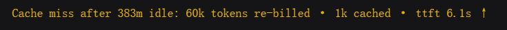

# dsh-cache-miss

[English](README.en.md)

DSH 网页插件：在一轮的**第一条 assistant 回复**正下方，以一条黄色单行提示该轮首次请求的提示缓存未命中（prompt cache miss）。

## 功能

一轮 Agent 对话是 `assistant -> tool -> assistant -> tool ...`。该轮**第一次**模型调用正是供应商提示缓存可能已过期、需要整段重新 prefill（重建缓存）的时机；同轮后续调用往往命中刚重建的缓存。DSH 自带的 token/缓存统计在输入框下方，产物文件行在轮尾，都无法在 miss 真正发生的位置就地提示。

本插件在轮首第一条 assistant 回复正下方，仅当该请求确为缓存未命中时渲染一条黄色单行：

```
Cache miss after 3m idle: 182k tokens re-billed · 0.8k cached · ttft 2.1s ↑
```


- `idle` —— 距上一轮结束的空闲时长。
- `re-billed` —— 该请求未命中缓存的输入 token 数（缩写为 k）。
- `cached` —— 同一 prefill 中命中缓存的部分（provider 回报时显示），让“重算量 vs 命中量”一目了然。
- `ttft` —— 首 token 时延（取自 assistant timing，可用时显示）；上箭头示意重建 prefill 通常更慢。

纯前端展示：不写入 session log，不修改 DSH 源码，也不占用 turn-tail 链，因此不会与产物文件行冲突（例如 `DSH-better-sidebar`）。

## miss 判定

`inputTokens` 是"未命中缓存的输入"（disjoint 口径），`cacheReadTokens` 是同一 prefill 中命中的部分，因此缓存命中率 `hitRatio = cacheReadTokens / (inputTokens + cacheReadTokens)`。一个请求同时满足以下三条才算 miss：

- `inputTokens > 0`；
- `hitRatio < 80%`（超过 20% 的输入未命中——因为上下文是累积的，这部分绝对量已经不小）；
- `inputTokens >= 1000`（至少有 1k token 真正被重新计费）。

不回缓存字段的 provider 按命中率 0 处理。正常续写（命中率 ≥ 80%）保持静默；`re-billed` 只显示未命中的 `inputTokens`。

miss 数据取自流中的 `usage` chunk（adapter 在终止 finish 之前就会发出），因此提示在 usage 到达时就出现（回复仍在生成中），不必等到 assistant 消息结束。每步在浏览器控制台输出一次，时间戳按浏览器本地时区。

## 安装

```sh
dsh plugin --profile web add https://github.com/wefio/dsh-cache-miss/releases/latest/download/dsh-cache-miss.tgz
```

重启 `dsh web`（或硬刷新正在运行的 GUI）以加载 client bundle。

## 已知限制

- TTFT 是 step 的 `step/start` 事件到首个非空 token delta 事件的墙钟间隔，取自会话事件时间；当任一边界落在已加载窗口之外时视为缺省（不显示 `· ttft ...` 段）。
- 节点对每个 assistant step 都会发布，但命中时渲染为空，因此命中轮不产生可见行；每一步至多输出一条控制台日志。
